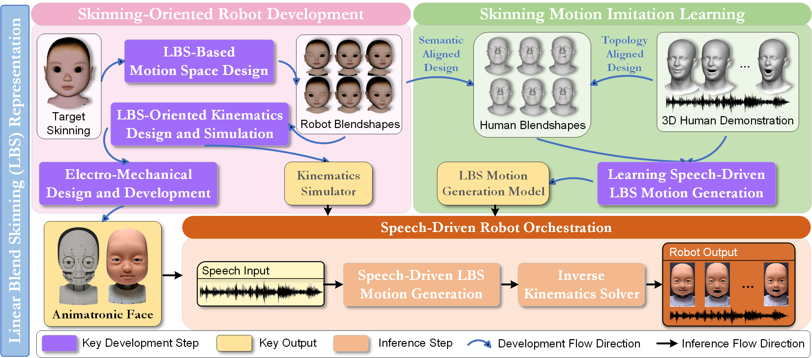

<h2 align="center">
  <span></span><b> Open Robot Expression</b>
</h2>

Welcome to the Open Robot Expression project. 
This project is dedicated to advancing the field of animatronic robots by enabling them to generate lifelike facial expressions. 
We invite researchers and developers to explore our code and contribute, joining us in pushing the boundaries of what's possible in human-robot interaction.
If you have any questions or suggestions, please feel free to [contact us](mailto:liboren@bigai.ai).

# News
**[2024.03.28]** We initialize the code release for the speech-driven robot. (Under construction)

**[2024.03.16]** We release the [paper](https://arxiv.org/pdf/2403.12670.pdf) for the speech-driven robot.

<h2 align="center">
  <b>Driving Animatronic Robot Facial Expression From Speech</b>
</h2>
<div align="center">
    <a href="https://arxiv.org/pdf/2403.12670.pdf" target="_blank">
    </a>
    <a href="https://library87.github.io/animatronic-face-iros24" target="_blank">
    </a>
</div>
&nbsp;
<div align="left">

</div>

Our approach is rooted in the principles of **Linear Blend Skinning (LBS)**, which serves as the core representation guiding the design and motion synthesis of the robot's embodiment. This approach allows for the generation of highly realistic, real-time facial expressions from speech, significantly enhancing the robot's ability to replicate nuanced human expressions for natural interaction.

The complexities of facial biomechanics and the synthesis of responsive motion present significant challenges in this field. However, our **skinning-centric approach**, which informs the actuation topology and enables human expression retargeting, is designed to overcome these challenges. For motion synthesis, our model is capable to generate realistic facial expressions in real-time at >4000fps on a single Nvidia RTX 4090, making it suitable for real-time human-robot interaction.

**Compatibility Notice:** The current release of our codebase is versatile and adaptable. It is designed to work seamlessly with both animatronic robots and virtual characters. If your interest lies in animating virtual characters, rest assured that this codebase is fully equipped to handle that as well. This flexibility allows for a wide range of applications and encourages innovation in various fields.

See more details in our [paper](https://arxiv.org/pdf/2403.12670.pdf) and [project page](https://library87.github.io/animatronic-face-iros24).
## Installation

1. Clone Github repo.
```shell
git clone git@github.com:library87/OpenRoboExp.git
cd OpenRoboExp
```

2. Create `conda` environment and install dependencies.
```shell
conda create -n openRoboExp python=3.11 -c conda-forge -y
conda activate openRoboExp

# install PyTorch, take our version for example
conda install pytorch==2.0.1 pytorch-cuda=11.8 -c pytorch -c nvidia

# install other dependencies with pip
pip install -r requirements.txt

# install ffmpeg
sudo apt install ffmpeg
```

3. Install third-party 3D renderer.
```shell
cd utils/render_utils
python setup.py build_ext --inplace
```

## Human Demonstration Data
We provide a data preparation pipeline using the [VOCA](https://voca.is.tue.mpg.de/) dataset, which consists of 3D human demonstrations. The dataset includes synchronized audio and 3D scans of human facial expressions, which can be used to train the robot to generate lifelike expressions.
[coming soon]

## Running
To **train** your own model, you first need to set the config file under `speech2roboExp/config/train.cfg`. Then you can run:
```shell
python run_speech2roboExp_train.py
```
For **inference**, you can run:
```shell
python run_speech2roboExp_inference.py
```
You can set the config file under `speech2roboExp/config/infer.cfg`. 
You can specify the input audio file, the subject id and the output video file in `run_speech2roboExp_inference.py`.
The subject id is in accordance with the VOCA set definition.

We highly recommend you to play with the **gui**, which is a more interactive way to explore the results. You can run:
```shell
python run_speech2roboExp_gui.py
```

Note that now the rendering is for a human face mesh just for visualization. 
We will release the actual robot mesh soon. 
The generated results are sequences of blendshape coefficients where blendshape definition follows the ARKit convention, which can be used to drive the robot face.

## BibTex
If you find this work useful, please consider citing:
```bibtex
@article{li2024driving,
  title={Driving Animatronic Robot Facial Expression From Speech},
  author={Li, Boren and Li, Hang and Liu, Hangxin},
  journal={arXiv preprint arXiv:2403.12670},
  year={2024}
}
```

## Acknowledgement
The authors are with National Key Laboratory of General Artificial Intelligence, Beijing Institute for General Artificial Intelligence (BIGAI).
